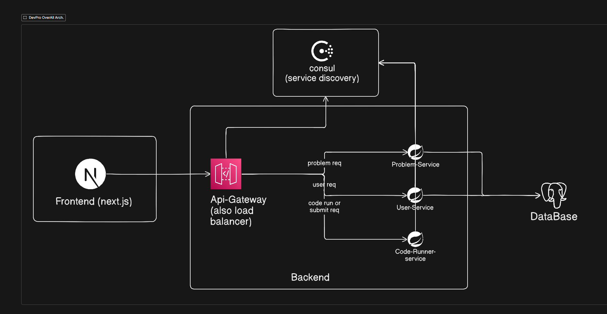
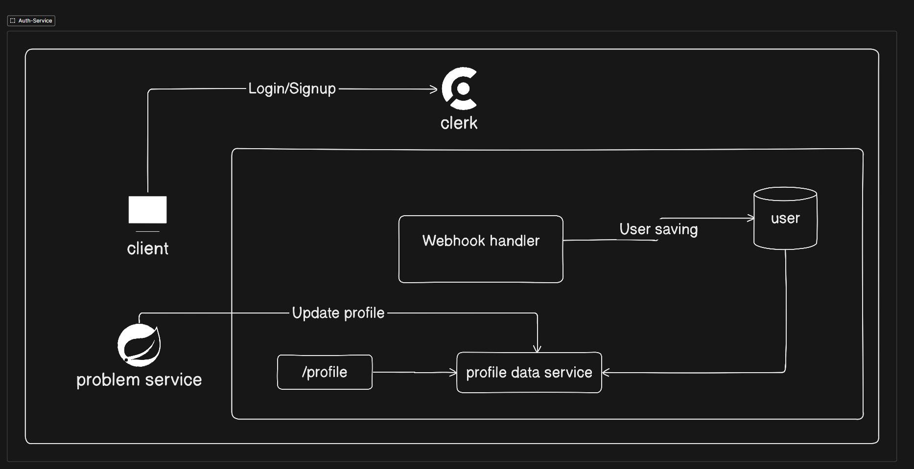
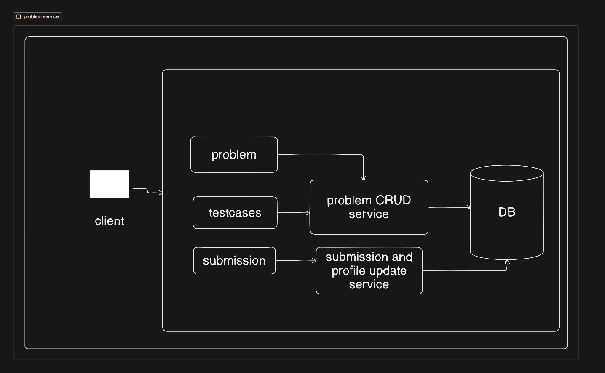
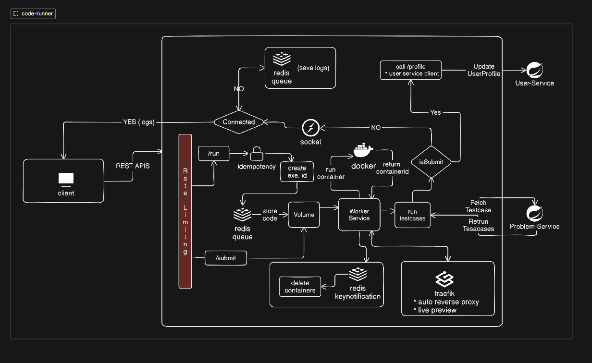
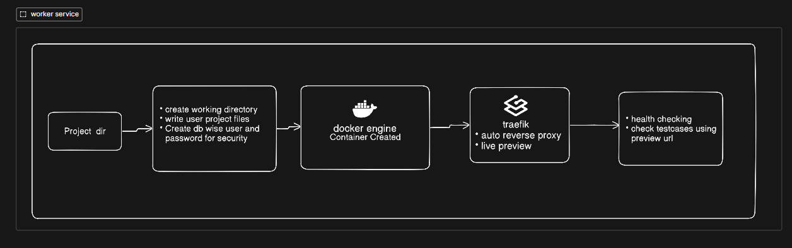
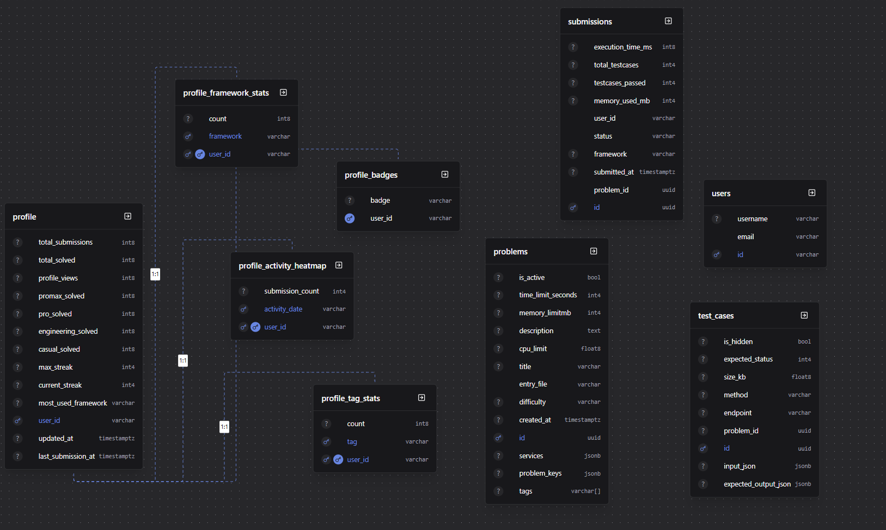

# DevPro 🚀

## Problem Statement
Traditional online coding platforms typically focus on algorithmic problem solving in standard language environments (e.g., standard input/output). However, modern software engineering requires a deep understanding of full-stack development, integrating APIs, connecting to databases, and working with popular frameworks. There is a lack of platforms that provide developers with a real-world, sandbox environment to build, run, and test code against live databases (Postgres, MongoDB) using production-grade frameworks.

## Quick Links

- [Project Title](#project-title)
- [Description](#description)
- [Tech Stack](#tech-stack)
  - [Frontend & Admin](#frontend--admin)
  - [Backend (Microservices)](#backend-microservices)
  - [Infrastructure & Databases](#infrastructure--databases)
- [Architecture Diagrams](#architecture-diagrams)
  - [1. Overall System Architecture](#1-overall-system-architecture)
  - [2. Authentication & User Management Flow](#2-authentication--user-management-flow)
  - [3. Problem Management Flow](#3-problem-management-flow)
  - [4. Code Execution Pipeline](#4-code-execution-pipeline)
  - [5. Worker & Execution Engine](#5-worker--execution-engine)
- [Database Schema](#database-schema)

## Project Title
**DevPro: Test your backend mastery**

## Description
DevPro is a comprehensive, microservices-based online coding platform that mimics real-world development environments. It allows users to write, execute, and test code securely within isolated Docker containers. Unlike standard competitive programming platforms, DevPro supports executing full-stack and backend framework code (such as Express, FastAPI, and more) with access to dedicated, shared databases (Postgres and MongoDB). 

The platform features a highly scalable backend built with Spring Boot microservices, a rich Next.js frontend with an integrated Monaco code editor, and an admin dashboard for problem management.

## Tech Stack

### Frontend & Admin
- **Framework:** Next.js 16 (App Router), React 19
- **Language:** TypeScript
- **Styling:** Tailwind CSS v4, Radix UI primitives
- **State Management:** Zustand, React Query
- **Editor:** Monaco Editor (`@monaco-editor/react`)
- **Authentication:** Clerk
- **Visualizations:** Recharts, Framer Motion

### Backend (Microservices)
- **Framework:** Java (Spring Boot)
- **Services:**
  - `api-gateway`: Handles API routing and load balancing.
  - `user-service`: Manages user profiles, streaks, and platform statistics.
  - `problem-service`: Manages problems, test cases, and user submissions.
  - `code-runner-service`: Interacts with the Docker daemon to spin up isolated execution environments for submitted code.

### Infrastructure & Databases
- **Databases:** PostgreSQL (Primary and Code Execution), MongoDB (Code Execution)
- **Caching & Messaging:** Redis
- **Service Discovery:** HashiCorp Consul
- **Reverse Proxy / Ingress:** Traefik
- **Code Execution:** Docker (Custom base images for Node.js, Python, etc.)

## Features

- Real-world backend and full-stack coding challenges
- Secure code execution using Docker containers
- PostgreSQL and MongoDB integration
- Multi-service execution environments
- Real-time logs via WebSockets
- Live application preview URLs
- Automated test case evaluation
- User profiles, streaks, badges, and activity heatmaps
- Admin dashboard for problem management
- Scalable Spring Boot microservices architecture

# Architecture Diagrams

Here is a visual breakdown of the DevPro platform's architecture and how the different microservices interact to provide a seamless full-stack execution environment.

## 1. Overall System Architecture

DevPro follows a **microservices-based architecture** designed for scalability, fault isolation, and independent service deployment. Client requests from the **Next.js frontend** are routed through a centralized **API Gateway**, which acts as the single entry point and load balancer for the backend. The gateway communicates with dedicated services responsible for user management, problem management, and code execution.

**Consul** provides service discovery, allowing services to dynamically register and locate one another without hardcoded endpoints. All persistent data is stored in **PostgreSQL**, while the **Code Runner Service** executes user submissions in isolated environments to ensure security and reliability.

### Key Components

- **Frontend (Next.js)** – User-facing web application.
- **API Gateway** – Centralized routing, load balancing, and request forwarding.
- **User Service** – Handles authentication, profiles, and user-related operations.
- **Problem Service** – Manages coding challenges, test cases, and metadata.
- **Code Runner Service** – Executes submissions and evaluates results.
- **Consul** – Service discovery and health monitoring.
- **PostgreSQL** – Primary persistent datastore.

### Design Highlights

- Microservices architecture for independent scaling and deployment.
- Centralized API Gateway for routing and traffic management.
- Dynamic service discovery using Consul.
- Secure and isolated code execution environments.
- Clear separation between user management, problem management, and execution workloads.
- Scalable foundation for handling large numbers of concurrent submissions.

## 2. Authentication & User Management Flow

DevPro uses **Clerk** for authentication and identity management while maintaining its own internal user and profile data. This approach separates authentication concerns from application-specific logic, allowing the platform to securely manage users, sessions, and permissions without storing sensitive credentials.

When a user signs up or logs in, Clerk handles authentication and triggers webhooks that synchronize user information with the platform's database. The profile service manages user-specific data such as solved problems, streaks, badges, activity history, and framework statistics. Other services can update profile information through internal APIs, ensuring a consistent and centralized source of user data.

### Key Components

- **Clerk** – Authentication, authorization, and session management.
- **Webhook Handler** – Synchronizes user events from Clerk.
- **User Database** – Stores application-specific user records.
- **Profile Data Service** – Manages profile statistics and analytics.
- **Client** – Initiates login, signup, and profile requests.
- **Internal Services** – Update profile metrics based on user activity.

### Design Highlights

- Authentication delegated to Clerk for enhanced security.
- Automatic user synchronization through webhooks.
- Separation of identity management and profile management.
- Centralized profile service for user analytics and statistics.
- Supports streaks, badges, activity tracking, and framework usage metrics.
- Prevents storage of sensitive authentication credentials within application services.

## 3. Problem Management Flow

The **Problem Service** is responsible for managing coding challenges, test cases, submissions, and profile-related updates. It serves as the central source of truth for problem metadata, execution constraints, and evaluation data while ensuring that user activity is accurately recorded and reflected in profile statistics.

Clients interact with the service to browse problems, retrieve test cases, and submit solutions. Dedicated internal modules handle problem management and submission processing independently, enabling cleaner separation of responsibilities and easier scalability.

### Key Components

- **Problem Module** – Manages problem statements, metadata, tags, and execution constraints.
- **Test Case Module** – Stores and retrieves public and hidden test cases.
- **Problem CRUD Service** – Handles creation, updates, deletion, and retrieval of problems.
- **Submission Service** – Processes submission records and execution results.
- **Profile Update Service** – Updates user statistics, streaks, solved counts, and activity metrics.
- **PostgreSQL Database** – Persistent storage for problems, test cases, submissions, and analytics data.

### Design Highlights

- Centralized management of coding challenges and evaluation data.
- Separation between problem management and submission processing workflows.
- Support for execution constraints such as CPU, memory, and time limits.
- Efficient storage and retrieval of hidden and public test cases.
- Automatic profile and statistics updates after submission processing.
- Scalable architecture that allows problem operations and submission workloads to evolve independently.

## 4. Code Execution Pipeline

The **Code Runner Service** is responsible for executing user submissions in secure, isolated environments while providing real-time feedback and scalable processing. It manages the complete execution lifecycle, from receiving code and provisioning containers to running test cases, streaming logs, and updating user statistics.

User requests are protected through rate limiting and idempotency controls before being dispatched to worker nodes. Each execution runs inside an isolated Docker container with dedicated storage volumes and predefined resource limits. Redis is used for job coordination, log streaming, and execution notifications, while WebSockets enable real-time communication between the platform and the client.

### Key Components

- **Rate Limiter** – Protects the platform from abuse and excessive requests.
- **Execution API** (`/run`, `/submit`) – Entry point for code execution and submissions.
- **Redis Queues** – Manage execution jobs, logs, and event notifications.
- **Worker Service** – Processes queued execution tasks.
- **Docker Runtime** – Creates isolated execution environments.
- **Volume Manager** – Stores user code and execution artifacts.
- **WebSocket Gateway** – Streams logs and execution updates in real time.
- **Problem Service Integration** – Fetches test cases and execution metadata.
- **User Service Integration** – Updates profile statistics after successful submissions.
- **Traefik** – Provides dynamic routing and live preview support.

### Design Highlights

- Secure execution of untrusted code using isolated Docker containers.
- Real-time log streaming through WebSockets.
- Redis-backed asynchronous execution pipeline.
- Support for framework-specific runtime environments.
- Idempotent execution requests to prevent duplicate runs.
- Automated container lifecycle management and cleanup.
- Profile and submission statistics updated after evaluation.
- Horizontally scalable worker architecture for concurrent executions.
- Built-in rate limiting and resource controls for platform stability.
- Live preview support for full-stack development challenges.

## 5. Worker & Execution Engine

The **Worker Service** is responsible for provisioning secure execution environments and running user submissions. It creates isolated workspaces, prepares the required project structure, launches runtime containers, and validates solutions against predefined test cases. By separating execution responsibilities from the API layer, the platform can efficiently process large numbers of concurrent submissions while maintaining security and reliability.

Each execution is performed inside a dedicated container with its own filesystem, runtime configuration, and resource limits. Once the environment is ready, the worker exposes a temporary preview endpoint, performs health checks, executes test cases, and reports the final execution results back to the platform.

### Key Components

- **Workspace Manager** – Creates isolated working directories for each execution.
- **Project Builder** – Generates project files and runtime configuration.
- **Docker Engine** – Launches secure execution containers.
- **Traefik Integration** – Provides dynamic routing and temporary preview URLs.
- **Health Checker** – Verifies application readiness before evaluation.
- **Test Executor** – Runs automated test cases against the running application.
- **Result Reporter** – Collects execution metrics and returns final verdicts.

### Design Highlights

- Dedicated execution environment for every submission.
- Isolated filesystem and runtime configuration per container.
- Dynamic preview URLs for full-stack application testing.
- Automated health checks before test execution.
- Secure execution with strict resource boundaries.
- Supports backend frameworks and multi-service challenges.
- Independent worker scaling for high submission throughput.
- Automatic cleanup of temporary files and execution containers.
- Reliable reporting of execution status, logs, and performance metrics.

# Database Schema

The platform uses **PostgreSQL** as its primary database to manage users, coding challenges, submissions, and profile analytics. The schema is designed to support scalable code execution, submission tracking, activity monitoring, streaks, badges, and personalized user statistics.

## Schema Overview

## Key Components

### Users & Profiles
- `users` stores account information such as username and email.
- `profile` maintains aggregated statistics including solved problems, submission counts, streaks, profile views, and framework usage.

### Problems & Test Cases
- `problems` contains coding challenges, execution limits, required services, tags, and metadata.
- `test_cases` stores public and hidden test cases used during code evaluation.

### Submissions
- `submissions` records every code execution attempt, including execution time, memory usage, framework used, status, and test case results.

### Analytics & Gamification
- `profile_tag_stats` tracks problem-solving distribution across different topics.
- `profile_framework_stats` records framework usage patterns.
- `profile_activity_heatmap` powers GitHub-style activity visualizations.
- `profile_badges` stores achievements and milestones earned by users.

## Design Highlights

- **Normalized Core Data** for users, problems, submissions, and test cases.
- **Precomputed Analytics Tables** for fast profile and dashboard loading.
- **Support for Multi-Service Challenges** through configurable execution environments.
- **Optimized for Scalability** with separation between transactional and analytical workloads.
- **Gamification Features** including streaks, badges, heatmaps, and framework statistics.